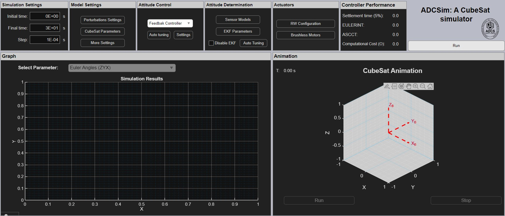

# ADCSim: Software for Attitude Determination and Control System Design and Simulation
## Overview
The design and validation of Attitude Determination and Control Systems (ADCS) for microsatellites require comprehensive and accessible simulation environments. This paper presents ADCSim, an open-source software package developed in MATLAB for the design, simulation, and validation of satellite ADCS. The software integrates detailed mathematical models for satellite kinematics and dynamics , along with models for common ADCS sensors (gyroscopes, accelerometers, magnetometers, star trackers) and actuators (reaction wheels). It features an intuitive Graphical User Interface (GUI) developed with MATLAB's App Designer to facilitate Model-in-the-Loop (MIL) simulations. ADCSim implements an Extended Kalman Filter (EKF) for attitude determination and features several non-linear control and torque allocation algorithms for attitude control. A key functionality is its robust algorithm to compute and visualize the 3D momentum envelope for various reaction wheel array configurations. Furthermore, it incorporates genetic algorithms to automatically tune the gains for both the EKF and attitude controllers, significantly streamlining the optimization process. By providing a comprehensive and integrated suite of tools, ADCSim offers a cost-effective and accessible platform for academic institutions and emerging aerospace programs to develop and test satellite attitude control systems.

