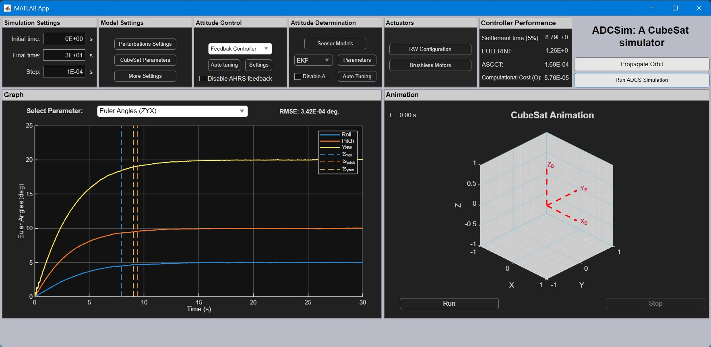
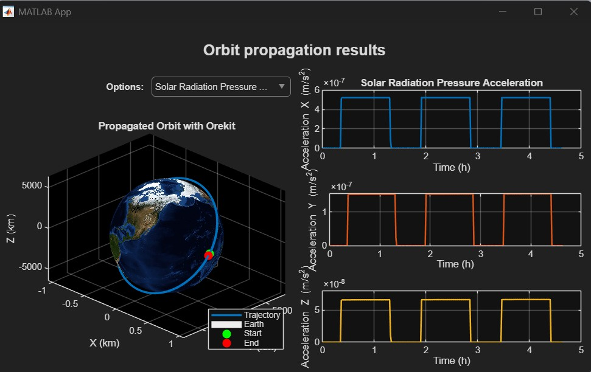

# ADCSim: Software for Attitude Determination and Control System Design and Simulation

## Overview
This paper presents ADCSim, an open-source MATLAB software package for the design, simulation, and validation of satellite Attitude Determination and Control Systems (ADCS). The software integrates detailed models for satellite dynamics, high-fidelity sensors (gyroscopes, accelerometers, magnetometers, star trackers), and actuators (reaction wheels). A key feature is its integration with the Orekit space dynamics library for realistic orbital environment modeling.

ADCSim features an intuitive Graphical User Interface (GUI) for Model-in-the-Loop (MIL) simulations, and implements multiple estimation algorithms (EKF, UKF, Madgwick) and non-linear controllers. Its advanced functionalities include a robust algorithm to compute and visualize the 3D momentum envelope for reaction wheel arrays and the use of genetic algorithms to auto-tune gains for both the EKF and attitude controllers. By providing a comprehensive suite of tools, ADCSim offers a powerful, cost-effective platform for developing and testing satellite attitude control systems.


Figure 1. ADCSim main window.


Figure 2. Orbit propagation results obtained from Orekit.

---

## Installation and Setup

### 1. Prerequisites
Before you begin, ensure you have the following software installed:
* **MATLAB**
* **Git** (for cloning the repository)
* **Java Development Kit (JDK)** (This is required to compile the `StepStorageHandler`).

### 2. Clone the Repository
Open your terminal and clone the repository:

```sh
git clone https://github.com/Bespi123/Satellite_ADCS_GUIDE
```
### 3. Project Structure

Satellite_ADCS_GUIDE/
├── lib/
│   ├── orekit/
│   │   ├── orekit-13.1.2.jar
│   │   ├── hipparchus-core-4.0.2.jar
│   │   ├── ... (all other jars)
│   │   └── orekit-data/
│   │       └── (data files and folders)
│   └── custom_java/
│       ├── compile_java_handler.m
│       └── StepStorageHandler.java
└── main.m
### 4. Download Dependencies
For the software to work, you must place the required files in the correct folders.

1.  **Download Orekit:** Download `orekit-13.1.2.jar` and place it inside the `lib/orekit` folder.
    * **Link:** [https://gitlab.orekit.org/orekit/orekit/-/releases](https://gitlab.orekit.org/orekit/orekit/-/releases)

2.  **Download Hipparchus:** Download all the Hipparchus-4.0.2 binary `.jar` files (e.g., `hipparchus-core-X.X.jar`, `hipparchus-filtering-X.X.jar`, etc.) and place them inside the `lib/orekit` folder.
    * **Link:** [https://hipparchus.org/downloads.html](https://hipparchus.org/downloads.html)

3.  **Download Orekit Data:** Download the `orekit-data.zip` file from the tutorials link.
    * **Link:** [https://gitlab.orekit.org/orekit/orekit-tutorials/-/releases](https://gitlab.orekit.org/orekit/orekit-tutorials/-/releases)
    * **Action:** Unzip the file and place the resulting `orekit-data` folder **inside the `lib/orekit/orekit-data` folder**.

Your final folder structure must match this diagram:

Satellite_ADCS_GUIDE/
├── lib/
│   ├── orekit/
│   │   ├── orekit-13.1.2.jar
│   │   ├── hipparchus-core-4.0.2.jar
│   │   ├── ... (all other jars)
│   │   └── orekit-data/
│   │       ├── (data files and folders)
│   └── custom_java/
        ├── compile_java_handler.m
        └── StepStorageHandler.java
└── main.m

### Installation and Startup

To run the ADCSim software, follow these steps:

1.  **Clone the Repository**
    Open your terminal or command prompt and clone the public Git repository to your local machine using the following command:
    ```sh
    git clone https://github.com/Bespi123/Satellite_ADCS_GUIDE
    ```

2. **Download Orekit and dependencies**
    Download Orekit binary file 'orekit-13.1.2.jar' inside: lib/orekit from https://gitlab.orekit.org/orekit/orekit/-/releases
    Download 'hipparchus' binary files inside: lib/orekit from https://hipparchus.org/downloads.html
    Download 'orekit-data' inside: lib/orekit/orekit-data/ from https://gitlab.orekit.org/orekit/orekit-tutorials/-/releases

Compile the StepStorageHandler.class using the compile_java_handler.m for this purpose it is necesary to download the java compiler. After that, verify that the StepStorageHandler.class was created successully.


3.  **Run the Application**
    Run the main.m file.

## Credits
bespi123
